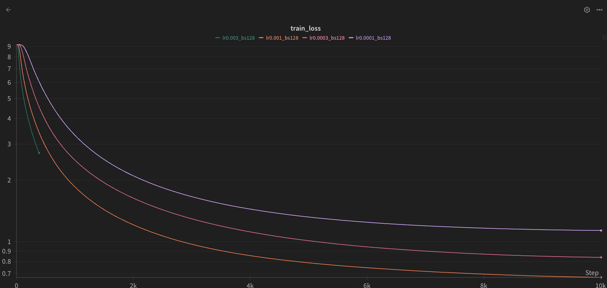
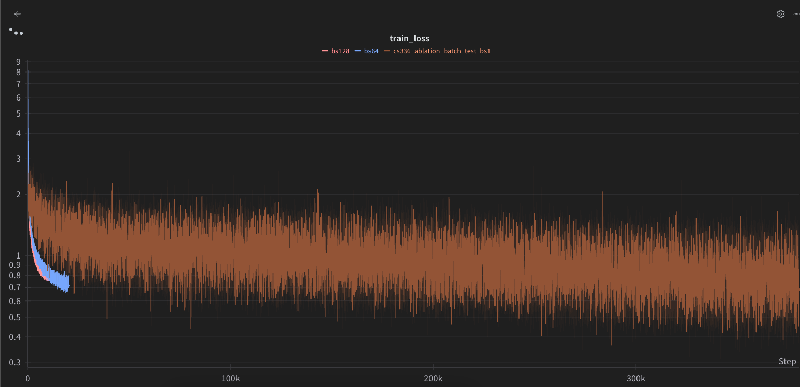
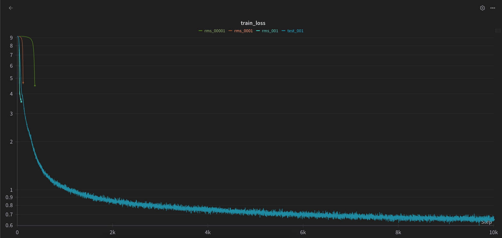
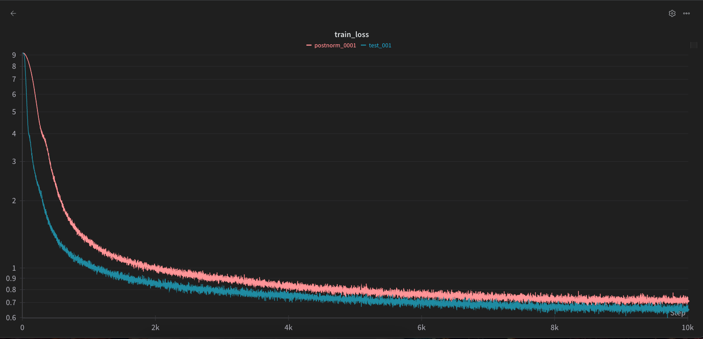
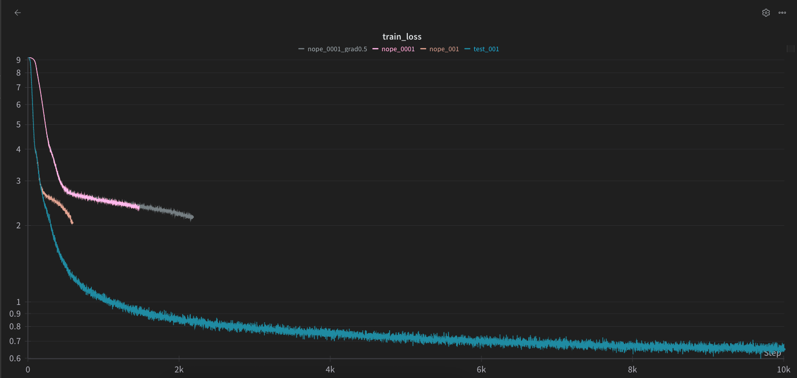
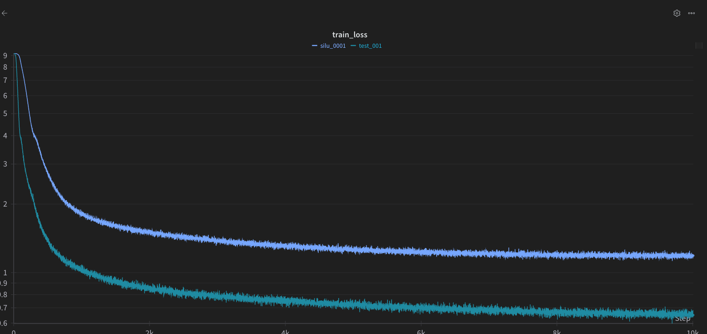

### Unicode1
a) `\x00` The escape character. 
b) When printed, nothing is shown. `__repr__` gives `'\\x00'`
c) It is basically ignored. `this is a teststring`

### Unicode2
a) They require more bytes per character, leading to longer sequence length.
b) Non ascii characters use more than 1 byte per character. "こんにちは!"
c) `b'\xC3\x28'` This indicates a 2 byte character but the second byte does not start with `10`

### Train_bpe_tinystories
a) On a M1 Mac, it took around 7 minutes with max memory usage of around 4GB
b) The merging logic took the most time. Command ran `uv run scalene cs336_basics/train_bpe.py --vocab_size 10000 --input_path data/TinyStoriesV2-GPT4-valid.txt --output_path "tinystories_bpe.pkl" --html`

### Train_bpe_expts_owt
a)The longest tokens in the tinystories and openwebtext tokenizers are [b' accomplishment', b' disappointment', b' responsibility'] and [b' -------------------------------------------']
b)"1000000" is encoded differently. Tinystories encodes the 0s individually while the 0s are paired in the openwebtext tokenizer

### Tokenizer_experiments
a) Tinystories Compression ratio: 4.150055991041433; OpenWebText ompression ratio: 2.89450713221205
b) The compression ratio becomes 3.211408999645683
c) The throughput is 1051852 bytes/second. It would take around 300 hours
d) The vocab can fit within 2^16-1=65535. Its the smallest data type that can still fit.

### Transformer_accounting
```python
def get_params(vocab_size, context_length, num_layers, d_model, num_heads, d_ff,):
    token_embeddings = vocab_size * d_model
    linear_head = vocab_size * d_model

    total = token_embeddings + linear_head

    for layer in range(num_layers):
        attn = d_model * d_model * 4
        ffn= 3 * d_model * d_ff
        rms = d_model * 2
        total += attn + ffn + rms

    return total + d_model # final ln
```
a) 2,127,057,600. At FP32, this is `8.5GB`
b) 6.6192361472 TFLOPS (10**12)
```python
def get_flops_matrix(a, b, c): # (a x b) * (b x c) = a x c
    return a * 2*b * c

def get_flops(vocab_size, context_length, num_layers, d_model, num_heads, d_ff):
    total = 0
    breakdown = {"attn": 0, "ffn": 0, "linear_head": 0}
    for layer in range(num_layers):
        attn_flops = 3 * get_flops_matrix(context_length, d_model, d_model) # qkv 
        attn_flops += get_flops_matrix(context_length, d_model, context_length) # attention_matrix 
        attn_flops += get_flops_matrix(context_length, context_length, d_model) # v
        attn_flops += get_flops_matrix(context_length, d_model, d_model) # output_projection
        total += attn_flops

        ffn = 3 * get_flops_matrix(context_length, d_model, d_ff) # w1
        ffn += get_flops_matrix(context_length, d_ff, d_model) # w2
        ffn += get_flops_matrix(context_length, d_model, d_ff) # w3
        total += ffn

        breakdown["attn"] += attn_flops
        breakdown["ffn"] += ffn

       # rms has no matrix multiplications
    linear_head = get_flops_matrix(vocab_size, d_model, d_model) # linear head
    total += linear_head
    breakdown["linear_head"] += linear_head

    return total, breakdown
flops_total, flops_breakdown = get_flops(vocab_size, context_length, num_layers, d_model, num_heads, d_ff) 
# TFLOPS, flops_breakdown
flops_total / 10**12,  {k: v / flops_total for k, v in flops_breakdown.items()}
```
c) The feed forward network
d) The feedforward network increases
GPT-2 Small: 0.44 TFLOPS; {'attn': 0.217, 'ffn': 0.65, 'linear_head': 0.133}
GPT-2 Medium: 1.445 TFLOPS; {'attn': 0.214, 'ffn': 0.713, 'linear_head': 0.073}
GPT-2 Large: 3.257 TFLOPS; {'attn': 0.208, 'ffn': 0.742, 'linear_head': 0.051}
GPT-2 XL: 6.619 TFLOPS;  {'attn': 0.201, 'ffn': 0.76, 'linear_head': 0.039}
e) 179.357 TFLOPS {'attn': 0.55, 'ffn': 0.449, 'linear_head': 0.001}. Attention takes up a higher proportion.

### Learning_rate_tuning
It diverges at 1e3 and fails to change at 1e2

### AdamWAccounting
a) Referencing [this](https://github.com/ZitongYang/cs336-assignment1-basics/blob/master/writeup.ipynb)
|                 | No.    | Parameters | Activations| Gradients | Adam States | Total           |
|-----------------|--------|------------|------------|-----------|-------------|-----------------|
| RMSNorm         | $2L+1$ | $d$        | $bld$      | $d$       | $2d$        | $(2L+1)(4d+bld)$|
| $Q/K/V$         | $L$    | $3d^2$     | $3bld$     | $3d^2$    | $6d^2$      | $L(12d^2+3bld)$ |
| $QK^T$          | $L$    | $0$        | $bhl^2$    | $0$       | $0$         | $Lbhl^2$        |
| softmax         | $L$    | $0$        | $bhl^2$    | $0$       | $0$         | $Lbhl^2$        |
| weighted_sum    | $L$    | $0$        | $bld$      | $0$       | $0$         | $Lbld$          |
| output_proj     | $L$    | $d^2$      | $bld$      | $d^2$     | $2d^2$      | $L(4d^2+bld)$   |
| $W_1$           | $L$    | $4d^2$     | $4bld$     | $4d^2$    | $8d^2$      | $L(16d^2+4bld)$ |
| SILU            | $L$    | $0$        | $4bld$     | $0$       | $0$         | $4Lbld$         |
| $W_2$           | $L$    | $4d^2$     | $4bld$     | $4d^2$    | $8d^2$      | $L(16d^2+4bld)$ |
| lm_head         | $1$    | $vd$       | $blv$      | $vd$      | $2vd$       | $4vd+blv$       |
| cross_entropy   | $1$    | $0$        | $bl$       | $0$       | $0$         | $bl$            |

Total = $48Ld^2 + (19L+1)bld + 2Lbhl^2 + (8L + 4)d + 4vd + blv + bl$
b) 18 is the maximum batch size 
c) AdamW is (3 + 3 + 7) = 12 FLOPs per param. backward is 2xForward. 19.8832331328 TFLOPS
d)
```python
second_per_step = (19.88 * 1024) / (19.5 * 0.5)
total = second_per_step * 400000
total / 3600 / 24 # 9666 days
```

### Learning Rate 

b) The best learning rate is as high as possible before instablity

### Batch Size 

It is good to go for a high batch size both for speed and convergence. However too high a batch size might not converge.


### Generations
```
there was a little boy named Tim. He loved to travel to the park with his mom and dad. The park was full of colors and fun things.
One day, Tim saw a big, red ball in the park. He wanted to play with it, so he ran to the ball and started to run after it. But, the ball was not a toy! It was a big, friendly dog named Spot. Spot was scared of the dog, but he wanted to play with 
```
```
there was a big park. The tree was a beautiful rabbit felt their mom. They both had a big been pond.
One day, the sun was in the water. The train had a beautiful to the rope. The bird flew down from the dog. The bird said, "Thank you, from the big bird." The bird had an idea. The bird felt from the dog did not know what they were not find t
```
```
here was a big dog named Spot. Spot was very fast. He loved to run and play all day. He had many friends in the park.
One day, Spot saw a big tree. He wanted to climb it. Spot jumped up and tried to take his foot. But, he was too small. The tree was too high. Spot tried again and again.
A kind girl named Lily saw Spot. She thought he would fit in the tree. She used the tree to fi
```

### LayerNorm

No RMSNorm makes the training completely unstable

### PostNorm 

PostNorm Fares worse

### NoPE

NoPE makes training unstable 

### SWIGLU

SWIGLU is better